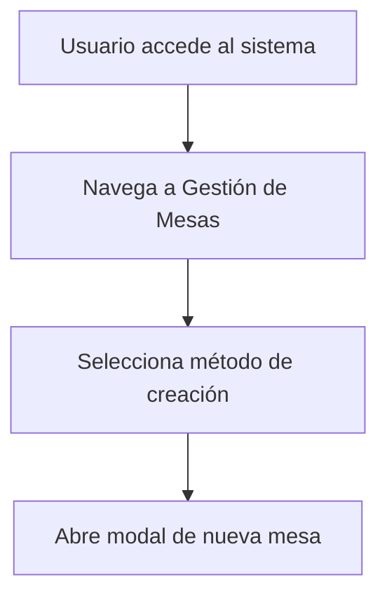
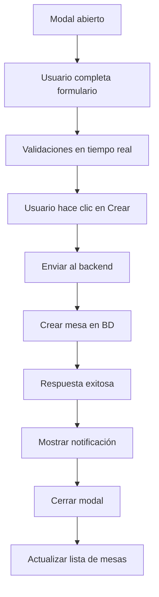
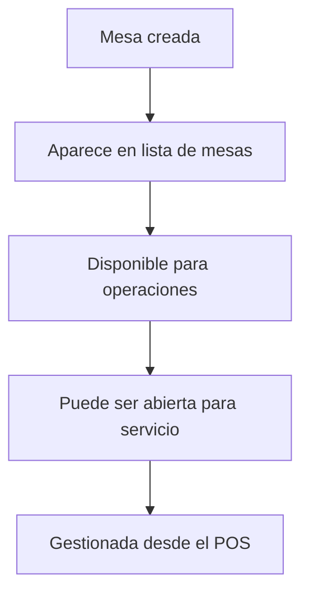

# 🪑 Guía para Crear Nuevas Mesas

## 📋 Descripción

La funcionalidad de crear nuevas mesas permite a los administradores agregar mesas adicionales al sistema de gestión del restaurante. Esta característica está integrada en el módulo de configuración y proporciona una interfaz profesional y intuitiva.

## 🚀 Cómo Crear una Nueva Mesa

### Método 1: Desde el Header Principal
1. **Navegar al módulo de Mesas**
   - Accede al sistema POS
   - Ve a la sección "Gestión de Mesas"

2. **Usar el botón "Nueva Mesa"**
   - En el header principal, busca el botón verde "Nueva Mesa"
   - Haz clic en el botón para abrir el modal de creación

3. **Completar el formulario**
   - Ingresa el número de mesa (obligatorio)
   - Selecciona la capacidad (2-10 personas)
   - Elige el estado inicial (Libre o Mantenimiento)
   - Haz clic en "Crear Mesa"

### Método 2: Desde la Pestaña de Configuración
1. **Acceder a Configuración**
   - En la gestión de mesas, ve a la pestaña "Configuración"
   - Navega a la subpestaña "Gestión Mesas"

2. **Usar el botón de creación**
   - Encuentra el botón "Nueva Mesa" en el header de la sección
   - Haz clic para abrir el modal

3. **Completar el formulario**
   - Sigue los mismos pasos que en el método 1

## 📝 Formulario de Creación

### Campos Requeridos

| Campo | Tipo | Descripción | Validaciones |
|-------|------|-------------|--------------|
| **Número de Mesa** | Número | Identificador único de la mesa | - Obligatorio<br>- Mayor a 0<br>- Único por sucursal |
| **Capacidad** | Selector | Número máximo de personas | - Entre 2 y 10 personas<br>- Opciones: 2, 4, 6, 8, 10 |
| **Estado Inicial** | Selector | Estado de la mesa al crearla | - Libre (disponible)<br>- Mantenimiento (fuera de servicio) |

### Validaciones del Sistema

```typescript
// Validaciones implementadas
- Número de mesa: Requerido y mayor a 0
- Capacidad: Entre 2 y 10 personas
- Estado: Libre o Mantenimiento
- Unicidad: El número debe ser único por sucursal
```

## 🎨 Interfaz de Usuario

### Modal de Creación
- **Diseño profesional** con gradientes y sombras
- **Iconografía consistente** con el resto del sistema
- **Formulario intuitivo** con validaciones en tiempo real
- **Feedback visual** para errores y éxitos

### Características del Modal
```typescript
interface ModalCrearMesa {
  titulo: "Crear Nueva Mesa"
  descripcion: "Configura los detalles de la nueva mesa"
  campos: [
    "Número de Mesa (obligatorio)",
    "Capacidad (selector)",
    "Estado Inicial (selector)"
  ]
  acciones: [
    "Cancelar (cierra modal)",
    "Crear Mesa (envía formulario)"
  ]
}
```

## 🔧 Funcionalidades Técnicas

### Backend
- **Endpoint**: `POST /api/v1/mesas/configuracion`
- **Validaciones**: Número único, capacidad válida, estado válido
- **Transacciones**: Creación atómica con rollback en caso de error
- **Logging**: Registro de todas las operaciones

### Frontend
- **Componente**: `MesaConfiguration.tsx`
- **Estado**: React Query para gestión de datos
- **Validaciones**: Cliente y servidor
- **Feedback**: Toast notifications para éxito/error

## 📊 Estados de Mesa

### Estados Disponibles
| Estado | Descripción | Color | Uso |
|--------|-------------|-------|-----|
| **Libre** | Mesa disponible para uso | Verde | Estado inicial recomendado |
| **Mantenimiento** | Mesa fuera de servicio | Rojo | Para mesas en reparación |

### Estados del Sistema
| Estado | Descripción | Comportamiento |
|--------|-------------|----------------|
| **En Uso** | Mesa ocupada con servicio | No se puede crear en este estado |
| **Pendiente Cobro** | Mesa esperando pago | No se puede crear en este estado |
| **Pagado** | Mesa con pago completado | No se puede crear en este estado |

## 🛡️ Seguridad y Permisos

### Roles Requeridos
- **Admin**: Acceso completo a crear mesas
- **Super Admin**: Acceso completo a crear mesas
- **Cajero**: Acceso limitado (solo lectura)
- **Mesero**: Sin acceso a esta funcionalidad

### Validaciones de Seguridad
```typescript
// Verificaciones implementadas
- Autenticación requerida
- Autorización por rol
- Validación de sucursal
- Verificación de permisos
```

## 📈 Flujo de Trabajo

### 1. Preparación


### 2. Creación


### 3. Post-Creación


## 🔍 Troubleshooting

### Problemas Comunes

#### Error: "El número de mesa ya existe"
- **Causa**: Intento de crear mesa con número duplicado
- **Solución**: Usar un número diferente
- **Prevención**: Verificar números existentes antes de crear

#### Error: "Capacidad inválida"
- **Causa**: Capacidad fuera del rango 2-10
- **Solución**: Seleccionar capacidad válida
- **Prevención**: Usar el selector proporcionado

#### Error: "No se pudo crear la mesa"
- **Causa**: Problema de conexión o permisos
- **Solución**: Verificar conexión y permisos
- **Prevención**: Asegurar permisos adecuados

### Logs del Sistema
```bash
# Logs de creación exitosa
INFO: Mesa con ID 25 creada exitosamente en sucursal 4 para el restaurante 1

# Logs de error
ERROR: Error al crear mesa: El número de mesa 25 ya existe en esta sucursal
```

## 📋 Checklist de Creación

### Antes de Crear
- [ ] Verificar números de mesa existentes
- [ ] Confirmar capacidad requerida
- [ ] Determinar estado inicial apropiado
- [ ] Verificar permisos de usuario

### Durante la Creación
- [ ] Completar todos los campos requeridos
- [ ] Verificar validaciones en tiempo real
- [ ] Confirmar datos antes de enviar

### Después de Crear
- [ ] Verificar que la mesa aparece en la lista
- [ ] Confirmar que está disponible para uso
- [ ] Probar funcionalidad de apertura de mesa

## 🎯 Mejores Prácticas

### Nomenclatura de Mesas
- **Consecutiva**: 1, 2, 3, 4...
- **Por sección**: A1, A2, B1, B2...
- **Por capacidad**: 4A, 6B, 8C...

### Capacidades Recomendadas
- **Mesas pequeñas**: 2-4 personas
- **Mesas medianas**: 6-8 personas
- **Mesas grandes**: 10+ personas

### Estados Iniciales
- **Nuevas mesas**: Estado "Libre"
- **Mesas en reparación**: Estado "Mantenimiento"
- **Mesas temporales**: Estado "Libre" con nota

## 🚀 Próximas Mejoras

### Funcionalidades Planificadas
- [ ] **Creación masiva** de mesas
- [ ] **Importación** desde archivos CSV
- [ ] **Templates** de configuración
- [ ] **Validación avanzada** de números
- [ ] **Preview** de mesa antes de crear

### Mejoras de UX
- [ ] **Autocompletado** de números
- [ ] **Sugerencias** de capacidad
- [ ] **Validación visual** mejorada
- [ ] **Accesos directos** de teclado

## 📞 Soporte

### Contacto Técnico
- **Email**: soporte@restaurante.com
- **Teléfono**: +1-555-0123
- **Horario**: Lunes a Viernes, 9:00-18:00

### Documentación Adicional
- [Guía de Gestión de Mesas](./MESA_CONFIGURATION.md)
- [Manual de Usuario](./USER_MANUAL.md)
- [API Documentation](./API_DOCS.md)

---

**Versión**: 2.1.0  
**Última actualización**: Diciembre 2024  
**Autor**: Equipo de Desarrollo 